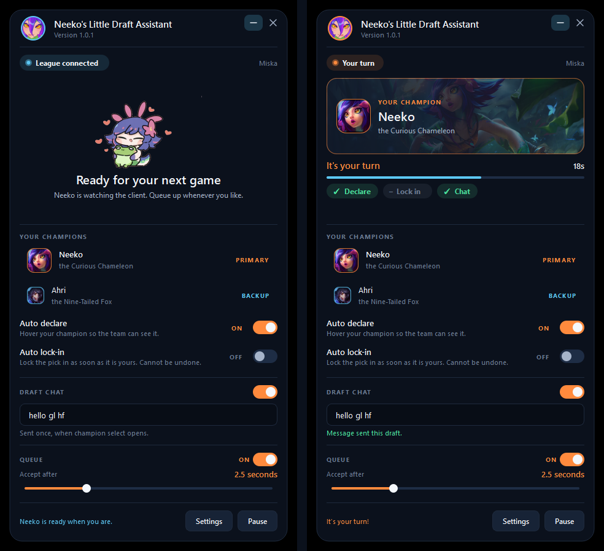

# Neeko's Little Draft Assistant

A small Neeko-themed companion for the League of Legends client. She answers the
queue pop, hovers your champion, locks it in if you ask her to, and says hello in
champion select — then stays out of the way in the tray.



## Features

- **Queue auto-accept**, with an adjustable delay if you want room to decline
- **Champion auto-declare** — hovers your pick so the team can see it
- **Optional auto lock-in** — only when the client says the pick is yours
- **Automatic champion select chat** — one line per draft, never repeated
- **A dashboard that follows the game** — the window shows a different scene
  when League is closed, idle, searching, popping, drafting or in a match
- **Neeko reacts** to what is happening, from the queue to the lock-in
- **Your own sound cue** — the built-in chime, an MP3 of your choosing, or silence
- **Windows tray app** — closing the window keeps her watching
- **Automatic updates** straight from GitHub Releases

## Installation

1. Download **`NeekoDraftAssistant-<version>-Setup.exe`** from the
   [latest release](https://github.com/seraphicidal/neeko-draft-assistant/releases/latest).
2. Run it. No administrator password, no Python — it installs just for you.
3. Launch **Neeko's Little Draft Assistant** from the Start menu.

The installer offers a desktop shortcut and a "start when I sign in" option.
Uninstall it like any other app, from Settings › Apps.

## Usage

Start Neeko before or after League — she finds the client whenever it appears and
reconnects on her own if it restarts.

1. Search for your champion and pick her from the list.
2. Optionally add a backup, for when your first choice is banned.
3. Choose what she is allowed to do: **auto declare**, **auto lock in**,
   **draft chat**, **auto accept**.
4. Close the window. She keeps watching from the tray icon.

The tray menu carries the same switches, plus **Pause**, which mutes everything
without changing your settings.

### What she will not do

- Act unless the client itself reports the action as in progress
- Pick a champion you did not name — if yours is banned or taken, she stops and
  says so
- Retry forever: three attempts with a 1s / 2s / 4s backoff, then she gives up
  and shows the problem
- Accept, hover, lock or chat more than once per lobby
- Touch bans

Auto lock-in ships **off**, because locking in cannot be undone.

## Configuration

Everything is in the main window; **Settings** holds the rest — startup
behaviour, the sound cue, log level and updates.

The queue page carries the sound: switch it off entirely, or choose an MP3 (or
WAV) of your own. The file is copied in beside your settings, so it keeps
working when the original is moved. Nothing else in the app makes a noise, and
only the accepted queue raises a Windows notification.

Settings live in `%APPDATA%\NeekoDraftAssistant\config.json`, well away from the
program folder, so **updating or reinstalling never touches your champion, your
backup, your draft message or your counters**. A file with a stray byte-order
mark still loads; a corrupted one is set aside as `config.json.corrupt` and
replaced with defaults rather than stopping the app.

### Your own Neeko art

Drop images into the `neeko` folder next to the installed executable, or into
`assets/neeko/` in a checkout, and restart:

| File | Where it shows up |
| --- | --- |
| `avatar.gif` / `avatar.png` | the round portrait in the header |
| `mood_idle.png` | waiting for the League client |
| `mood_happy.png` | connected, lobby and post-game |
| `mood_alert.png` | match found, and your turn to pick |
| `mood_calm.png` | locked in, and in game |
| `portrait.png` | champion select |

Anything missing falls back to what ships with the app. Settings › About lists
which slots are filled. `python tools/prepare_neeko.py <folder>` cuts the
background out of your own illustrations and files them under these names.

## Updating

Neeko checks GitHub Releases shortly after start and every few hours. When
there is something new she shows a single strip at the top of the window:

> Neeko found something new! Version 1.0.1 is available. **[Update now]** [Later]

Choosing **Update now** downloads the installer, hands over to it and reopens
the new version. Nothing is downloaded, prompted or restarted while you are in a
ready check, a champion select or a game — she waits.

**Settings › Updates** shows the installed version, a **Check for updates**
button and the release notes.

## Development

```bash
git clone https://github.com/seraphicidal/neeko-draft-assistant.git
cd neeko-draft-assistant
pip install -r requirements.txt
python main.py
```

Python 3.10+ on Windows. PySide6 is the only runtime dependency.

```
league/   the client: lcu_client, gameflow, matchmaking, champion_select, chat,
          champions, champion_art
core/     settings, state_machine, watcher, updater, logbook, startup, paths,
          version
ui/       theme (design tokens), widgets (components), status (state to words),
          stage (the scenes), main_window, settings_window, tray, art_loader, app
tests/    one file per area, plus the fake client in mocks.py
tools/    build, art preparation, champion list refresh, LCU probe, UI preview
```

Three layers, kept apart on purpose:

* **`league/`** talks to the client and makes no decisions
* **`core/state_machine.py`** makes every decision and performs no I/O
* **`ui/`** renders state and decides nothing

That split is what lets champion select be tested without a champion select,
and it is why `ui/status.py` -- which turns a state into words, colour and art
-- is covered by ordinary unit tests.

Useful scripts:

```bash
python -m unittest discover -s tests -t .   # the whole suite
python tools/probe_lcu.py                   # read-only check of every endpoint
python tools/preview.py draft               # the UI against a scripted client
python tools/preview.py offline             # ...and every other state
python tools/prepare_neeko.py               # cut out new Neeko illustrations
python tools/fetch_champions.py             # refresh the bundled champion list
```

`tools/preview.py` takes any of `offline`, `connected`, `queue`, `ready`,
`draft`, `myturn`, `game`, `pick` and `settings`.

## Building

```bash
pip install -r requirements-dev.txt
winget install -e --id JRSoftware.InnoSetup
python tools/build.py --clean
```

Produces `dist/NeekoDraftAssistant/` (the app) and
`dist/NeekoDraftAssistant-<version>-Setup.exe` (the installer).

## Releasing

1. Bump `__version__` in `core/version.py` — the only place a version is written.
2. Commit it.
3. Tag and push:

```bash
git tag v1.0.1
git push origin v1.0.1
```

GitHub Actions then checks the tag against `core/version.py`, runs the tests,
builds the app and the installer, and publishes the release. **If the tests
fail, nothing is released.**

## Troubleshooting

**She says "Waiting for League".** The client is not running, or it was started
before her — she retries every two seconds, so give it a moment.

**Nothing happens in champion select.** Check the switches in the main window,
and that Pause is off. Whatever she decided is written to the log: Settings ›
Advanced, with the log level on Debug.

**"Preferred champion is banned or already taken."** Working as intended — she
will not substitute a champion you did not choose. Add a backup champion.

**The champion art is missing.** Art comes from the running client first and
Riot's CDN second, and is cached in
`%LOCALAPPDATA%\NeekoDraftAssistant\champions`. Without either, the name and
your switches still work.

**The tray icon is hidden.** Windows 11 hides new tray icons behind the `^`
chevron. Drag it onto the taskbar to keep it in sight.

## Riot's rules

Riot tolerates read-only LCU tools of this kind — the popular overlays accept
queues the same way — but the published LCU policy asks developers to contact
Riot and stick to an approved endpoint list *before releasing* an app that uses
it, and to keep such apps away from players in Korea. That applies to
distribution, not to running your own copy. This is not legal advice.

Nothing here reads or writes game memory, nothing is injected, and no part of
actual gameplay is automated: it presses client buttons through the client's own
local API.
